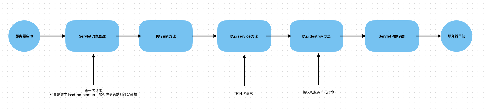
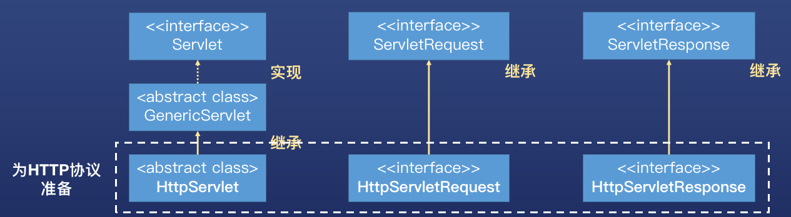

# Web-App-Demo

## Web app注意点
1. Web应用的名字：ContextPath指定了web应用的名字。
2. 为什么浏览器中会显示 index.jsp的内容。因为通过 Tomcat 服务器启动的 web应用 的默认欢迎页是 index.jsp。
3. web.xml 的文件名能不能改，WEB-INF目录名能不能改？不可以改，这是Servlet规范的一部分。
4. Main目录下创建的目录能否不叫webapp。可以叫其他名字，这个目录的名字不是 Servlet 规范的一部分。

### 使用jar创建第一个servlet
1. 下载servlet的jar包，版本确认需要看tomcat的官网，java8以及以上应该有servlet4
2. Idea 里面找到project structure的Library，把servlet的jar加入
3. 找到tomcat安装目录把例子的web.xml拷贝出来修改一下。 （/Library/tomcat/webapps/examples/WEB-INF）
4. 自己的servlet类实现Servlet接口，追加自己的逻辑代码即可

### 用Tomcat来部署webApp
1. 进入tomcat目录下的webapps文件夹
2. 在webapps目录下创建文件夹hotel，这个文件夹是我们webapp的根目录，文件夹的名称就是我们webapp请求路径的根路径
3. webappRoot下创建WEB-INF文件夹
4. WEB-INF下创建classes文件夹
5. 将项目的web.xml赋值到WEB-INF下面
6. 将项目的out目录赋值到刚才创建的classes下面
7. 启动tomcat

### webapp标准目录结构


### 创建过程
```
第一步：IDEA 创建空工程
第二步：IDEA 创建模块，build system 选择 Maven，修改 GroupId
第三步：在 main 目录下创建 webapp 目录，webapp 目录下创建 WEB-INF
第四步：在 WEB-INF 目录下创建 web.xml
第五步：填写 web.xml，建议从其他地方复制，例如从 TomcatRoot -> webapps -> examples 项目中复制，删除多余的内容，仅保留一个 servlet 和 servlet-mapping 作为后续参考
第六步：编辑 pom.xml，修改打包方式为 war
第七步：编辑 pom.xml，引入 javax.servlet-api 依赖，重新加载 Maven
第八步：在代码包路径下创建 Servlet 类，例如 QueryRoomServlet，实现 Servlet 接口
第九步：编辑 web.xml，配置 servlet 和 servlet-mapping
第十步：编辑 Configuration，增加一个 SmartTomcat 的 Configuration 
第十一步：配置 Configuration  
    Deployment directory : webapp 路径  
    Use classpath of module : hotel  
    Context path: /hotel  
第十二步：在 IDEA 中启动 Tomcat
第十三步：打开浏览器，在地址栏输入 http://localhost:8080/hotel/queryRoom
```

## maven优化webapp的部署
1. 在项目根目录下面创建配置文件pom.xml
2. 右键点击pom.xml，将项目标记为一个maven项目
3. 写pom文件
4. IDEA右边侧栏Maven，reload项目
5. 打war包，package指令
6. 把target文件夹中生成的war包赋值到Tomcat的app下面
7. 启动tomcat

# Servlet
## 概念相关
### 生命周期
Servlet对象的生命周期：一个 Servlet 对象从出生（创建）到死亡（销毁）的整个过程

## 生命周期方法
### Servlet 对象的 service 方法什么时候被调用
service 方法在用户访问 Servlet 对象的请求路径时被调用。
请求一次就会调用一次。

### Servlet对象什么时候实例化
> 验证方式：为servlet类创建无参构造函数  
>> Servelet对象是由web服务器利用反射机制调用无参构造器创建。因此，无参构造器被调用的时刻就是servlet对象实例化的时刻

> Servlet对象是在服务器启动时被实例化的嘛？
>> 不是，默认情况下，服务器启动时Servlet对象不会被实例化

> Servlet对象实例化的时机？
>> 用户第一次访问时，Servlet对象被实例化

> 为什么不在服务器启动的时候实例化Servlet对象？
>> 节约内存资源。坏处是首次调用时会比较慢

> 怎么配置servlet在启动的时候就实例化？
>> load-on-startup,数字越小，优先级越高
```xml
    <servlet>
        <servlet-name>myFirstServlet</servlet-name>
        <servlet-class>com.app.web.MyFirstServlet</servlet-class>
        <load-on-startup>1</load-on-startup>
    </servlet>
```

### Servlet对象创建了几个
> 验证方法？
>> 在service方法中打印当前对象的地址，在浏览器中反复刷新请求，观察每次打印的对象地址

> 结论
>> 每次请求，service方法被执行，打印的相同的对象地址，证明每次执行请求的都是同一个Servlet对象    
>> 无参构造器只是被调用了一次，也证明了Servlet对象只创建了一个  
>> Servlet对象是单例的，创建之后就保存下来，需要时时取出来使用  

### Servlet的init方法
**结论：**
- init方法在无参构造器方法直径完成后（即Servlet对象被创建出来后）被调用
- init方法只被调用一次

**作用：**
- 有些场景下，servlet对象被创建出来后，需要执行初始化，例如链接数据库

> 为什么不在无参构造函数里面编写初始化逻辑？  
> - 可以在无参构造函数中编写初始化逻辑，但不建议这么做。
> - 不建议程序员创建无参构造函数，一旦误给无参构造函数加上参数，会导致 Servlet 无法被实例化。
> - 对象创建出来后在 init 方法中执行初始化，这种设计思想很常见，在多种框架，例如 Spring 中也会用到。

### Servlet的destroy方法
**结论：**
- servlet对象的destroy方法在服务关闭前被调用

**作用：**
- 用于释放资源，比如数据库链接

**destroy方法被调用的时候，servlet对象是否已经被销毁？**
destroy方法被调用时，servlet对象还没有被销毁，因为destroy方法是实例方法，必须有对象存在才能被调用

### Servlet对象生命周期总结

- Servlet 对象默认在第一次请求到来时创建，如果配置了 load-on-startup 是在服务启动时创建。
- init 方法在对象创建完成后被调用。
- Servlet 是单实例的，一个 Servlet 类只创建一个对象，init 方法只调用一次。
- 每次请求都会调用 service 方法。
- 接收到服务关闭指令，在Servlet对象销毁前会调用 destroy 方法，destroy 方法只执行一次。

### Servlet对象由谁来维护 - web容器
**结论：**
- Servlet对象是由web服务器维护的，比如说tomcat

**什么是web容器：**
- Web 容器（ Web Container），用于存放 Servlet 对象，管理 Servlet 对象的整个生命周期。
- Web 容器负责：
  - 在合适的时机创建 Servlet 对象，并执行 Servlet 对象的 init 方法初始化对象。
  - 调用 Servlet 对象的 service 方法响应用户请求
  - 在服务关闭前销毁对象，并在销毁前调用对象的 destroy 方法。


# HttpServlet介绍
## 概述
- HttpServlet 是 Servlet 规范的一部分，继承 GenericServlet，专门为 HTTP 协议准备，比 GenericServlet 更加适合 HTTP 协议下的开发。
- HttpServletRequest 继承 ServletRequest，是 HTTP 协议专用的请求对象，封装 HTTP 请求的全部内容，面向 HttpServletRequest 接口编程就能够获得 HTTP 请求中的全部信息。
- HttpServletResponse  继承 ServletResponse，是 HTTP 协议专用的响应对象。



## 模版方法设计模式
- 模板方法模式，定义一个操作中算法的骨架，将步骤的具体实现延迟到子类中。使得子类可以在不改变一个算法的结构的情况下，就可以重定义该算法的某些特定步骤。
- 为什么用模板方法设计模式：因为生活中很多事物可以抽取共性，这些共性可以固化为骨架，个性的东西交给具体实现。
- 模板方法的优势：既统一了算法，也提供了很大的灵活性。父类模板方法确保算法结构不变，子类提供部分步骤的实现。

```java
public abstract class People {
    
    public void oneDay() {
        wakeup();
        washFace();
        goToSchool();
    }
    
    public void wakeup() {
        // empty
    }
    
    public void washFace() {
        System.out.println("Wash face and brush tooth");
    }
    
    public void goToSchool() {
        // empty
    }
}

public class Student extends People{

  @Override
  public void wakeup() {
    System.out.println("Parents wake kid up");
  }

  @Override
  public void goToSchool() {
    System.out.println("Taking school bug go to school");
  }
}

public class Teacher extends People{

  @Override
  public void wakeup() {
    System.out.println("Waken up by alarm");
  }

  @Override
  public void goToSchool() {
    System.out.println("Taking subway go to school");
  }
}
```

## HttpServlet 源码解析
### init方法
- HttpServlet 并没实现 init 方法，使用的父类 GenericServlet 的 init 方法
- Java 程序员可以选择实现无参数的 init 方法，实现初始化逻辑
```java
public void init(ServletConfig config) throws ServletException {
    this.config = config;
    this.init();
}

public void init() throws ServletException {
}
```

### service方法
- 从 GenericServlet 继承的 service 方法
```java
    public void service(ServletRequest req, ServletResponse res) throws ServletException, IOException {
        if (req instanceof HttpServletRequest && res instanceof HttpServletResponse) {
            // req和res都是子类的类型，可以执行向下转型
            HttpServletRequest request = (HttpServletRequest)req;
            HttpServletResponse response = (HttpServletResponse)res;
            
            // 调用HttpServlet自定义的service方法
            this.service(request, response);
        } else {
            throw new ServletException("non-HTTP request or response");
        }
    }
```

- HttpServlet 定义的 service 方法，使用了模板方法设计模式。
- 模板方法定义了算法骨架，不同请求方法类型执行不同的分支。
- Java 程序员自定义 Servlet 继承 HttpServlet，不去重写 service 方法，而是根据请求方法类型重写对应的 doXXX方法。
```java
    protected void service(HttpServletRequest req, HttpServletResponse resp) throws ServletException, IOException {
        String method = req.getMethod();
        long lastModified;
        if (method.equals("GET")) {
            lastModified = this.getLastModified(req);
            if (lastModified == -1L) {
                this.doGet(req, resp);
            } else {
                long ifModifiedSince = req.getDateHeader("If-Modified-Since");
                if (ifModifiedSince < lastModified) {
                    this.maybeSetLastModified(resp, lastModified);
                    this.doGet(req, resp);
                } else {
                    resp.setStatus(304);
                }
            }
        } else if (method.equals("HEAD")) {
            lastModified = this.getLastModified(req);
            this.maybeSetLastModified(resp, lastModified);
            this.doHead(req, resp);
        } else if (method.equals("POST")) {
            this.doPost(req, resp);
        } else if (method.equals("PUT")) {
            this.doPut(req, resp);
        } else if (method.equals("DELETE")) {
            this.doDelete(req, resp);
        } else if (method.equals("OPTIONS")) {
            this.doOptions(req, resp);
        } else if (method.equals("TRACE")) {
            this.doTrace(req, resp);
        } else {
            String errMsg = lStrings.getString("http.method_not_implemented");
            Object[] errArgs = new Object[]{method};
            errMsg = MessageFormat.format(errMsg, errArgs);
            resp.sendError(501, errMsg);
        }

    }
```

- 为什么不建议Java程序员重写 service 方法？
> - HttpServlet 的 service 方法包含请求方法类型检查的逻辑
> - 例如，如果请求方法类型是 POST，但Java程序员没有重写 doPost 方法，会报405错误
> - 因此，正规的开发流程是，Java程序员(后端程序员)定义请求方法类型，前端使用对应的类型发送请求，前后端保持一致。 
```java
    protected void doPost(HttpServletRequest req, HttpServletResponse resp) throws ServletException, IOException {
        String protocol = req.getProtocol();
        String msg = lStrings.getString("http.method_post_not_supported");
        if (protocol.endsWith("1.1")) {
            resp.sendError(405, msg);
        } else {
            resp.sendError(400, msg);
        }

    }
```

- 为什么我们自定义的Servlet get 方法没有使用缓存？
> - 想要自定义 Servlet get要使用缓存，那么需要维护数据的最近变更时间，并告知浏览器。
> - 这种机制比较复杂，非静态资源数据不建议使用。
> - 我们可以使用后端缓存，不使用浏览器的缓存机制。

```java
protected void service(HttpServletRequest req, HttpServletResponse resp) throws ServletException, IOException {
    String method = req.getMethod();
        long lastModified;
        if (method.equals("GET")) {

            // 获取服务器的最新修改时间 
            lastModified = this.getLastModified(req);
            
            // 默认值是-1，如果是-1，那么说明首次访问，直接调用doGet方法，不走缓存
            if (lastModified == -1L) {
                this.doGet(req, resp);
            } else {
                
                // 如果不是-1，那么就要拿出浏览器的最新修改时间做比较
                // 如果服务器时间比浏览器时间新，说明资源已经更新但是浏览器不知道，需要重新取资源
                long ifModifiedSince = req.getDateHeader("If-Modified-Since");
                if (ifModifiedSince < lastModified) {
                    this.maybeSetLastModified(resp, lastModified);
                    this.doGet(req, resp);
                } else {
                    // 否则的话就是两边时间相等，那么可以直接使用缓存
                    resp.setStatus(304);
                }
            }
        } ...
    }
```

### HttpServletRequest 接口详解-请求对象由谁创建
- HttpServletRequest 是接口，那接口的实现类是谁定义的？实现类的对象是谁创建的？
  - 实现类由 web 服务器（Tomcat）定义，实现类的对象由 web 服务器创建并传入 service 方法
  - 但我们并不需要关心实现类，只需要面向 HttpServletRequest 接口编程
- HttpServletRequest 中封装了哪些信息？
  - 封装了 HTTP 请求的全部信息
  - 客户端遵循 HTTP 协议，发送的请求符合 HTTP 请求格式要求，web 服务器按照 HTTP 请求格式解析数据并封装到 HttpServletRequest 实现类的对象中，将该对象传入 service 方法


### HttpServletRequest 接口详解-获取浏览器提交的数据
```java
Map<String, String[]> parameterMap = req.getParameterMap(); // 获取参数名称和参数值map
Enumeration<String> parameterNames = req.getParameterNames(); // 获取所有参数名称
String[] values = req.getParameterValues("names"); // 根据参数名称获取参数值（一维数据）
String name = req.getParameter("name"); // 根据参数名称获取参数值，最常用
```

