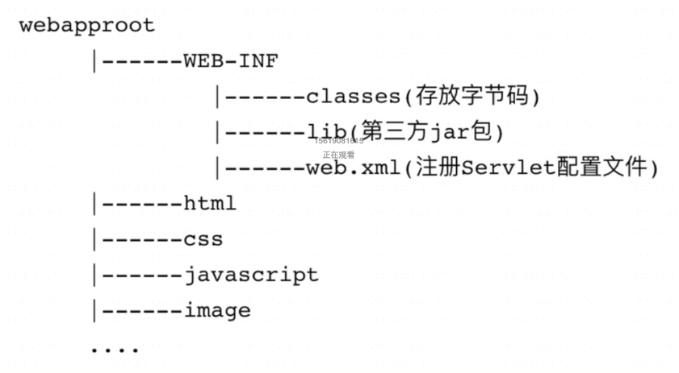

# Web-App-Demo

## Web app注意点
1. Web应用的名字：ContextPath指定了web应用的名字。
2. 为什么浏览器中会显示 index.jsp的内容。因为通过 Tomcat 服务器启动的 web应用 的默认欢迎页是 index.jsp。
3. web.xml 的文件名能不能改，WEB-INF目录名能不能改？不可以改，这是Servlet规范的一部分。
4. Main目录下创建的目录能否不叫webapp。可以叫其他名字，这个目录的名字不是 Servlet 规范的一部分。

### 使用jar创建第一个servlet
1. 下载servlet的jar包，版本确认需要看tomcat的官网，java8以及以上应该有servlet4
2. Idea 里面找到project structure的Library，把servlet的jar加入
3. 找到tomcat安装目录把例子的web.xml拷贝出来修改一下。 （/Library/tomcat/webapps/examples/WEB-INF）
4. 自己的servlet类实现Servlet接口，追加自己的逻辑代码即可

### 用Tomcat来部署webApp
1. 进入tomcat目录下的webapps文件夹
2. 在webapps目录下创建文件夹hotel，这个文件夹是我们webapp的根目录，文件夹的名称就是我们webapp请求路径的根路径
3. webappRoot下创建WEB-INF文件夹
4. WEB-INF下创建classes文件夹
5. 将项目的web.xml赋值到WEB-INF下面
6. 将项目的out目录赋值到刚才创建的classes下面
7. 启动tomcat

## webapp标准目录结构
